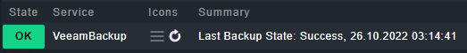
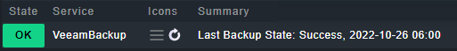

# checkmk localcheck for Veeam Agent

These scripts can be used to add a (checkmk) service check for Veeam Agent.
Since there is no built-in check for the Agent (only for Veeam B&R) in checkmk,
i decided to write one of my own. They are tested with the FREE Version only.

## Table of Contents

* [Windows](#powershell-script-for-veeam-agent-for-windows-50)
    * [Example](#example)
    * [Installation](#installation-windows)
* [Linux](#shell-script-for-veeam-agent-for-linux-50)
    * [Example](#example)
    * [Installation](#installation-linux)

## Powershell Script for Veeam Agent for Windows (5.0)

The Powershell script parses the Log of the Agent located in "C:\ProgramData\Veeam\Endpoint". This should be always the same, according to https://www.veeam.com/kb2404. Updates may possibly break this, so it's work in progress.

successfully tested with (feel free to contribute more):
- v5.0.3.4708

### Example:
This is how the output of the script can look like

```
2 "VeeamBackup" - Last Backup State: Failed, 24.10.2022 17:24:31
```

This is how the check look like in checkmk WebUI:



### Installation Windows

1. Copy the `veeam-check.ps1` to `C:\ProgramData\checkmk\agent\local`
2. Run a Discovery on your host

## Shell Script for Veeam Agent for Linux (5.0)

The Shell script parses the output of the Veeam Agent CLI. It uses `veeamconfig session list` to retrieve the status of the last backups. You can check the usage of the CLI here: https://helpcenter.veeam.com/docs/agentforlinux/userguide/ui_overview_cmd.html?ver=50

successfully tested with (feel free to contribute more):
- v5.0.0.4318

### Example:
This is how the output of the script can look like

```
0 "VeeamBackup" - Last Backup State: Success, 2022-10-26 06:00
```

This is how the check look like in checkmk WebUI:



### Installation Linux

1. copy the `veeam-check.sh` to `/var/lib/checkmk/local`
    ```sh
    wget https://github.com/Steffen-MLR/veeam-agent-check/raw/master/linux/veeam-check.sh
    sudo mv veeam-check.sh /var/lib/checkmk/local
    ```
2. make the file executable
    ```sh
    sudo chmod +x /var/lib/checkmk/local/veeam-check.sh
    ```
3. Run a Discovery on your host